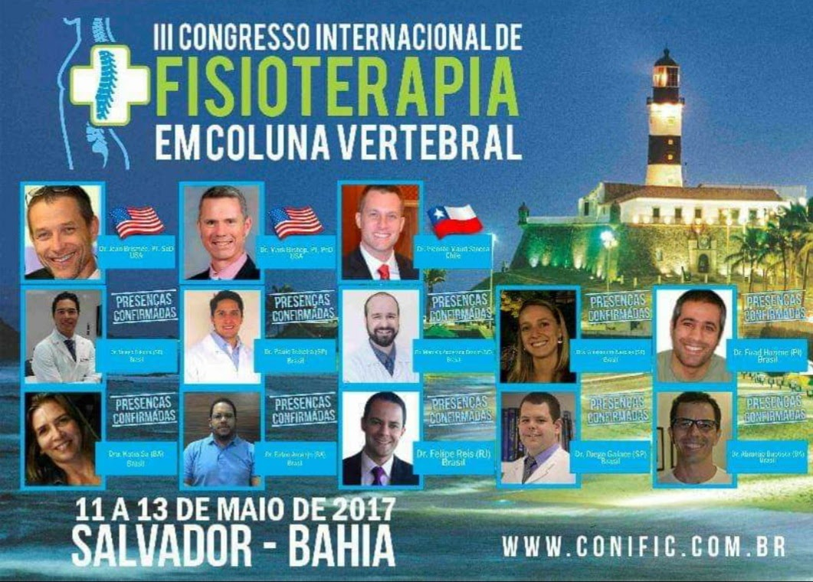

Während meines Physiotherapie-Studiums hatte ich die Gelegenheit, an verschiedenen Veranstaltungen teilzunehmen. Eine meiner unvergesslichen Erfahrungen war - Congresso Internacional de Fisioterapia em Coluna Vertebral - der Internationale Kongress für Physiotherapie und Wirbelsäule (2017), bei dem ich Teil des Organisationskomitees war.

Als Teil des Organisationskomitees konnte ich  bedeutsam Fähigkeiten in Bezug auf Zeitmanagement, Organisation und Kommunikation mit anderen Teammitgliedern erwerben. Darüber hinaus konnte ich viel über die neuesten Entwicklungen in der Physiotherapie bei der Behandlung von Wirbelsäulenproblemen lernen.

Die Referenten auf dem Kongress waren führende Experten auf ihrem Gebiet und ich konnte von ihren Präsentationen und Diskussionen profitieren. Ich habe auch viele wertvolle Kontakte geknüpft, die mir dabei geholfen haben, mein Wissen und meine Fähigkeiten in der Physiotherapie zu entwickeln.

Insgesamt war der Internationale Kongress für Physiotherapie und Wirbelsäule eine unvergessliche Erfahrung, die mich als Physiotherapeutin verbessert hat und mir geholfen hat, mein Wissen und meine Fähigkeiten in diesem Bereich zu erweitern.

